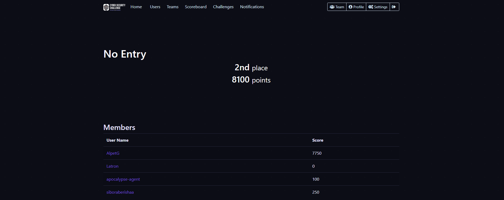
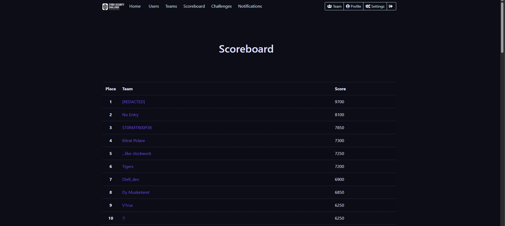

# CSC26 - Cyber Security Challenge Kosova & Albania

> This Challage are not offical write up this are my challage i solve in my way

- Web
  - [WarmUp](./Web/Warmup/README.md) (50 pts)
  - [Safe Vault](./Web/Save%20Vault/README.md) (100 pts)
  - [Pixelated Login](./Web/Pixel%20Login/README.md) (100 pts)
  - [Alias Manager](./Web/Alias%20Manager/README.md) (150 pts)
  - [Access Control](./Web/Access%20Controll/README.md) (200 pts)
  - [Silent Operator](./Web/Silent%20Operator/README.md) (300 pts)
  - [Museum Backdoor](./Web/Museum%20Backdoor/README.md) (400 pts)
  - [E-Commerce Platform](./Web/E-Commnerce%20Platform/README.md) (600 pts)
  - [Analizer](./Web/Analizer/README.md) (600 pts)
  - [Filtered Access](./Web/Filtered%20Access/README.md) (600 pts)
  - [Secret Vault](./Web/Secret%20Vault/README.md) (650 pts)
  - [Air Quality Monitor](./Web/Air%20Quality%20Monitor/README.md) (650 pts)
  - [Blog Security](./Web/BlogSecurity/README.md) (650 pts)
  - [Cross-site Render](./Web/Cross-site%20Render/README.md) (1000 pts)
  - [Career Portal](./Web/Career%20Portal/README.md) (1200 pts)

- Scripting
  - [Code Breaker](./Scripting/README.md) (300 pts)

- OT-ICS
  - [What_is_encrypti0n?](./OT-ICS/What_is_encrypti0n/README.md) (150 pts)
  - [Retro Motor Override](./OT-ICS/Retro%20Motor%20Override/README.md) (250 pts)

- Reverse Engineering & Pwn
  - [Obfuscated](./Reverse%20engineering%20&%20pwn/Obfuscated/README.md) (150 pts)
  - [Password Cracker](./Reverse%20engineering%20&%20pwn/password-cracker/README.md) (200 pts)

- Cryptography
  - [NATO's Secret](./Cryptography/Nato/README.md) (100 pts)
  - [Around the World](./Cryptography/Arcond%20The%20Waski/README.md) (100 pts)
  - [Citrix Exposed](./Cryptography/Citrix%20Expose/README.md) (150 pts)
  - [Word Locked](./Cryptography/Wrad%20Lenddas/README.md) (150 pts)
  - [Onion Encoding](./Cryptography/Onion%20Encoding/README.md) (150 pts)
  - [Vigenere](./Cryptography/Vigenere/README.md) (150 pts)
  - [Rotate](./Cryptography/Rotate/README.md) (150 pts)
  - [Drunken Typist](./Cryptography/Drunken%20Typist/README.md) (150 pts)

- Forensics & Steganography
  - [Slide the cat](./Forensics%20&%20Steganography/Slide%20The%20Cat/README.md) (100 pts)
  - [Slides](./Forensics%20&%20Steganography/Slides/README.md) (150 pts)
  - [Puzzle Pack](./Forensics%20&%20Steganography/Puzzle%20Pack/README.md) (150 pts)
  - [The Pirate's Hidden Vault](./Forensics%20&%20Steganography/pirate/README.md) (150 pts)
  - [BonBon](./Forensics%20&%20Steganography/bonbon/README.md) (150 pts)
  - [Passwordcracker](./Forensics%20&%20Steganography/Passwordcracker/README.md)

